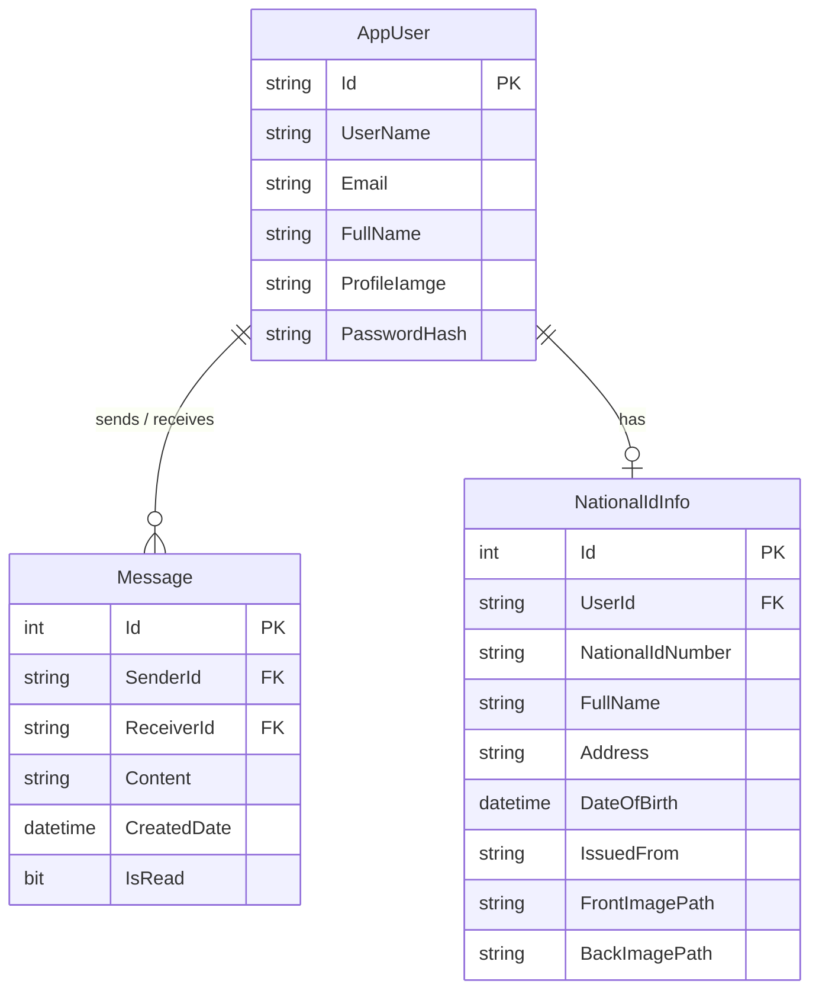

# Nexus Chat | Real-Time Communication Platform

[](https://angular.dev/)
[](https://dotnet.microsoft.com/)
[](https://learn.microsoft.com/aspnet/core/signalr/introduction)
[](https://webrtc.org/)
[](https://tailwindcss.com/)
[](https://learn.microsoft.com/ef/core/)
[](https://www.microsoft.com/sql-server/)

**Nexus Chat** is a full-stack real-time communication platform built with **ASP.NET Core 8 Web API** and **Angular 19**. It delivers instant one-on-one text messaging via **SignalR WebSockets** and peer-to-peer audio/video calling using native **WebRTC** signaling. The application is styled with a "Cyber-Glass" dark interface, dynamic **GSAP** animations, and responsive mobile adaptations.

---

## UI Showcase

| Futuristic Authentication | Glassmorphism Chat Interface |
| :---: | :---: |
|  |  |

| P2P WebRTC Video Calling | Responsive Mobile Chat Drawer |
| :---: | :---: |
|  |  |

---

## Key Features

### 💬 Real-Time Messaging & Presence
* **Instant Delivery**: Bi-directional messaging powered by ASP.NET Core SignalR hubs over WebSockets.
* **Message Persistence & Pagination**: Stores conversation history in SQL Server with paginated retrieval.
* **Unread Message Tracking**: Automatic unread badge counters that clear upon opening a conversation.
* **Live User Presence**: Real-time tracking of active and idle users backed by an in-memory concurrent dictionary.
* **Typing Indicators**: Real-time broadcast of typing state (`User is typing...`) with automatic expiration timers.
* **Desktop Notifications**: Browser-native push alerts when contacts connect to the network.

### 📹 Peer-to-Peer Video & Audio Calling
* **WebRTC Signaling**: Custom SignalR hub (`/hubs/vide`) for SDP Offer, SDP Answer, and ICE candidate exchange.
* **Call Controls**: Interactive controls for microphone mute/unmute, camera toggle, call decline, and session termination.
* **Media Handling**: Picture-in-picture local preview with mirrored video feed alongside full-screen remote stream rendering.
* **STUN Server Integration**: Configured with Google public STUN servers for NAT traversal.

### 🎨 Cyber-Glass UI / UX
* **Glassmorphic Aesthetic**: Translucent cards with `backdrop-filter: blur()`, neon accents, and dark background palettes (`#0f172a`).
* **Motion & Micro-interactions**: GSAP-driven list entrances, button pulse states, and smooth modal transitions.
* **Responsive Layout**: Desktop split-view layout adapting down to a mobile drawer with horizontal avatar reels.

### 🔐 Authentication & Security
* **ASP.NET Core Identity**: User registration and password hashing.
* **JWT Bearer Authentication**: Stateless token generation with custom claim mapping.
* **WebSocket Token Interception**: Query-string token authorization (`access_token`) for SignalR hub handshakes.
* **Client-Side Route Protection**: Angular functional guards (`authGuard` and `loginGuard`) with HTTP interceptors.
* **Avatar Uploads**: Multipart form handling for profile images served through ASP.NET Core static files.

---

## Technology Stack

### Backend
| Technology | Description |
| :--- | :--- |
| **C# / .NET 8.0** | Target runtime and framework (`net8.0`) |
| **ASP.NET Core Web API** | REST API endpoints for user authentication and profile management |
| **ASP.NET Core SignalR** | Real-time communication and WebRTC signaling hubs |
| **Entity Framework Core 8** | ORM for SQL Server database persistence and migrations |
| **ASP.NET Core Identity** | User account management and authentication stores |
| **JWT Bearer (Microsoft.AspNetCore.Authentication.JwtBearer)** | Token validation and authorization pipeline |
| **Swashbuckle (Swagger/OpenAPI)** | Interactive API exploration and Bearer security documentation |

### Frontend
| Technology | Description |
| :--- | :--- |
| **Angular 19** | Standalone component architecture and signals |
| **TypeScript 5.5** | Strongly typed frontend codebase |
| **@microsoft/signalr** | Client library for SignalR WebSocket connections |
| **WebRTC API** | Browser-native `RTCPeerConnection`, `RTCSessionDescription`, and `RTCIceCandidate` |
| **Tailwind CSS v4** | Utility-first responsive styling |
| **GSAP (GreenSock)** | High-performance interface animations |
| **Angular Material & CDK 19** | Dialog modals, snackbars, icons, and menus |
| **RxJS 7** | Reactive state streams and event handling |

---

## Architecture Overview

Nexus Chat follows a client-server architecture decoupled into a RESTful API backend, WebSocket signaling layer, and a single-page frontend application.

```
┌─────────────────────────────────────────────────────────────────────────────┐
│                             Angular 19 Client                               │
│                                                                             │
│  ┌───────────────────┐  ┌────────────────────┐  ┌────────────────────────┐  │
│  │   AuthService     │  │ ChatServiceService │  │      VideoService      │  │
│  │ (HTTP / JWT / Me) │  │  (SignalR - /chat) │  │  (SignalR & WebRTC)    │  │
│  └─────────┬─────────┘  └──────────┬─────────┘  └───────────┬────────────┘  │
└────────────┼───────────────────────┼────────────────────────┼───────────────┘
             │ HTTP (JSON/Multipart) │ SignalR (WebSockets)   │ WebSockets + P2P Media
             ▼                       ▼                        ▼
┌─────────────────────────────────────────────────────────────────────────────┐
│                         ASP.NET Core 8 Web API                              │
│                                                                             │
│  ┌───────────────────────┐ ┌───────────────────┐ ┌───────────────────────┐  │
│  │   AccountController   │ │     Chat Hub      │ │       Vide Hub        │  │
│  │   (Auth & Profile)    │ │(Messages/Presence)│ │  (WebRTC Signaling)   │  │
│  └───────────┬───────────┘ └─────────┬─────────┘ └───────────┬───────────┘  │
│              │                       │                       │              │
│  ┌───────────┴───────────────────────┴───────────────────────┴───────────┐  │
│  │                     JWT Authentication & User Provider                │  │
│  └───────────────────────────────────┬───────────────────────────────────┘  │
│                                      │                                      │
│  ┌───────────────────────────────────┴───────────────────────────────────┐  │
│  │                   AppDbContext (Entity Framework Core)                │  │
│  └───────────────────────────────────┬───────────────────────────────────┘  │
└──────────────────────────────────────┼──────────────────────────────────────┘
                                       ▼
                       ┌───────────────────────────────┐
                       │       SQL Server Database     │
                       │ (Users, Messages, Identities) │
                       └───────────────────────────────┘
```

### SignalR & WebRTC Signaling Workflow

1. **Authentication**: The client retrieves a JWT token upon logging in. When connecting to `/hubs/chat` or `/hubs/vide`, the token is passed via the `access_token` query parameter and extracted in `OnMessageReceived`.
2. **Presence & Messaging**: Upon connection to `Chat` hub, the user's connection ID is registered in `onlineUsers`. Messages sent via `SendMessage` are stored in SQL Server and routed directly to the recipient's connection ID.
3. **P2P Video Handshake**:
   - **Caller** invokes `SendOffer` on `Vide` hub with the SDP offer.
   - **SignalR** relays `ReceiveOffer` to the recipient.
   - **Callee** responds with `SendAnswer`, which is forwarded back to the caller as `ReceiveAnswer`.
   - **ICE Candidates** are continuously exchanged via `SendIceCandidate` and `ReceiveIceCandidate` until a direct P2P connection is formed.

---

## Project Structure

```text
Chat/
├── API/                              # ASP.NET Core 8 Web API
│   ├── Controllers/
│   │   └── AccountController.cs      # Login, Register, Profile endpoints
│   ├── Data/
│   │   └── AppDbContext.cs           # EF Core DbContext (Identity + Messages)
│   ├── DTOs/                         # Request and Response transfer models
│   │   ├── AuthResponseDto.cs
│   │   ├── LoginDtos.cs
│   │   ├── MessageRequestDto.cs
│   │   ├── MessageResponseDto.cs
│   │   ├── OnlineUserDto.cs
│   │   └── RegisterDTOs.cs
│   ├── Extenions/
│   │   ├── ClaimsPrincipeExtenions.cs# Claims principal helper methods
│   │   └── NameUserIdProvider.cs     # Custom SignalR IUserIdProvider
│   ├── Hubs/
│   │   ├── Chat.cs                   # Real-time chat & presence hub
│   │   └── Vide.cs                   # WebRTC signaling hub
│   ├── Migrations/                   # EF Core database migrations
│   ├── Models/                       # Domain & Identity entities
│   │   ├── AppUser.cs
│   │   ├── Message.cs
│   │   └── NationalIdInfo.cs
│   ├── wwwroot/
│   │   └── profile_images/           # Uploaded user avatars
│   ├── appsettings.json              # Production configuration template
│   ├── appsettings.Development.json  # Development connection string & JWT configuration
│   ├── Program.cs                    # Application startup & DI registration
│   └── API.csproj
│
├── Client/                           # Angular 19 Frontend
│   ├── src/
│   │   ├── app/
│   │   │   ├── chat/                 # Main chat container view
│   │   │   ├── components/
│   │   │   │   ├── chat-sidebar/     # Contact list, search, mobile drawer
│   │   │   │   ├── chat-window/      # Active conversation, message stream
│   │   │   │   ├── typing-indicator/ # Animated typing dots
│   │   │   │   └── video/            # WebRTC video call dialog & media streams
│   │   │   ├── guards/
│   │   │   │   ├── auth.guard.ts     # Protected route guard
│   │   │   │   └── login.guard.ts    # Guest route guard
│   │   │   ├── login/                # Authentication page
│   │   │   ├── register/             # Registration page with avatar upload
│   │   │   ├── Models/               # TypeScript interfaces & DTOs
│   │   │   ├── services/
│   │   │   │   ├── auth.service.ts   # Authentication & session state
│   │   │   │   ├── chat-service.service.ts # SignalR chat hub client
│   │   │   │   └── video.service.ts  # SignalR WebRTC signaling client
│   │   │   ├── auth.interceptor.ts   # HTTP Bearer token injector
│   │   │   ├── app.config.ts         # Application configuration & providers
│   │   │   └── app.routes.ts         # Client routing definitions
│   │   ├── styles.css                # Global styles & Tailwind CSS imports
│   │   └── main.ts
│   ├── angular.json
│   ├── package.json
│   └── tsconfig.json
│
├── screenshots/                      # Application preview screenshots
├── Chat.sln                          # Visual Studio solution file
└── README.md
```

---

## Getting Started

### Prerequisites
* [.NET 8.0 SDK](https://dotnet.microsoft.com/download/dotnet/8.0)
* [Node.js](https://nodejs.org/) (v18 or higher) & `npm`
* [SQL Server](https://www.microsoft.com/sql-server/) (LocalDB, SQL Express, or full instance)
* [Angular CLI](https://angular.dev/tools/cli) (`npm install -g @angular/cli`)

---

### Installation & Setup

#### 1. Clone the Repository
```bash
git clone https://github.com/kareem-elawamy/Chat.git
cd Chat
```

#### 2. Backend Setup

1. Navigate to the `API` directory:
   ```bash
   cd API
   ```

2. Configure connection string and JWT settings in `appsettings.Development.json` (or `appsettings.json`):
   ```json
   {
     "ConnectionStrings": {
       "DefaultConnection": "Server=localhost;Database=Chatapp;Trusted_Connection=True;TrustServerCertificate=True;"
     },
     "JWTSetting": {
       "securityKey": "YOUR_SECRET_KEY_AT_LEAST_32_CHARACTERS_LONG",
       "ValidAudience": "http://localhost:4200",
       "ValidIssuer": "http://localhost:5000"
     }
   }
   ```

3. Apply database migrations:
   ```bash
   dotnet ef database update
   ```

4. Restore dependencies and run the backend:
   ```bash
   dotnet restore
   dotnet run
   ```
   The backend API will start at `http://localhost:5000` (or `https://localhost:5001`).
   Access the Swagger UI at `http://localhost:5000/swagger`.

---

#### 3. Frontend Setup

1. Open a new terminal and navigate to the `Client` directory:
   ```bash
   cd Client
   ```

2. Install npm dependencies:
   ```bash
   npm install
   ```

3. Start the Angular development server:
   ```bash
   npm start
   ```
   *Alternatively:*
   ```bash
   ng serve --open
   ```
   The frontend application will run at `http://localhost:4200/`.

---

## API & Real-Time Documentation

### REST API Endpoints (`/api/Account`)

| Method | Endpoint | Access | Content-Type | Description |
| :--- | :--- | :--- | :--- | :--- |
| `POST` | `/api/Account/Register` | Anonymous | `multipart/form-data` | Register new user with username, email, password, and avatar file |
| `POST` | `/api/Account/Login` | Anonymous | `application/json` | Authenticate user and receive JWT bearer token |
| `GET` | `/api/Account/GetUserDetails` | Authorized | `application/json` | Retrieve current authenticated user profile |

---

### SignalR Hubs

#### Chat Hub (`/hubs/chat`) — Requires Authorization

| Direction | Method / Event | Payload | Description |
| :--- | :--- | :--- | :--- |
| **Client ➔ Hub** | `SendMessage` | `MessageRequestDto` (`{ receiverId, content }`) | Persists and sends a message to the target recipient |
| **Client ➔ Hub** | `LoadMessages` | `receiverId` (string) | Loads paginated conversation history with target user |
| **Client ➔ Hub** | `NotifyTyping` | `recipientUserId` (string) | Sends typing event to specific recipient |
| **Client ➔ Hub** | `GetUserDetails`| `userId` (string) | Requests profile information for a specific user |
| **Hub ➔ Client** | `OnlineUsers` | `List<OnlineUserDto>` | Broadcasts updated online/offline user list and unread counts |
| **Hub ➔ Client** | `ReceiveMessage` | `MessageResponseDto` | Delivers incoming message to receiver |
| **Hub ➔ Client** | `ReceieveMessageList` | `List<MessageResponseDto>` | Returns conversation message history |
| **Hub ➔ Client** | `NotifyTyping` | `userName` (string) | Displays typing status on the recipient's UI |
| **Hub ➔ Client** | `Notify` | `AppUser` | Broadcasts user online event for push notifications |

#### Video Hub (`/hubs/vide`) — WebRTC Signaling

| Direction | Method / Event | Payload | Description |
| :--- | :--- | :--- | :--- |
| **Client ➔ Hub** | `SendOffer` | `receiverId`, `offer` (JSON string) | Sends WebRTC SDP offer to recipient |
| **Client ➔ Hub** | `SendAnswer` | `receiverId`, `answer` (JSON string) | Returns WebRTC SDP answer to caller |
| **Client ➔ Hub** | `SendIceCandidate` | `receiverId`, `candidate` (JSON string) | Relays ICE network candidate to peer |
| **Client ➔ Hub** | `EndCall` | `receiverId` (string) | Terminates active call session |
| **Hub ➔ Client** | `ReceiveOffer` | `senderName`, `offer` | Receives incoming SDP offer |
| **Hub ➔ Client** | `ReceiveAnswer` | `senderName`, `answer` | Receives SDP answer from peer |
| **Hub ➔ Client** | `ReceiveIceCandidate`| `senderName`, `candidate` | Receives ICE candidate from peer |
| **Hub ➔ Client** | `CallEnded` | None | Notifies peer that call has terminated |

---

## Database Schema



---

## Quality & Engineering Notes

* **Stateless Token Authentication**: Web API operations validate standard JWT headers (`Authorization: Bearer <token>`).
* **Real-time Reconnection**: Frontend SignalR connections use `.withAutomaticReconnect()` to gracefully handle network drops.
* **Concurrency Handling**: Online user state is managed using thread-safe `ConcurrentDictionary` on the server.
* **Testing Status**: The client includes default Angular Jasmine/Karma test specifications. Automated backend test suites and end-to-end testing frameworks are not currently part of the repository.

---

## Roadmap & Current Scope

- [x] JWT-based Authentication & Profile Image Upload
- [x] SignalR Real-Time One-on-One Messaging
- [x] Unread Messages Counting & Read Receipts
- [x] Typing Indicators & Online Presence Broadcasts
- [x] Peer-to-Peer WebRTC Audio/Video Calling
- [x] Cyber-Glass Responsive UI with GSAP Animations
- [ ] Group Chat & Channel Support
- [ ] Media & File Sharing within Chat Messages
- [ ] End-to-End Test Coverage (Playwright / Cypress)

---

## License

This project is open source and available under the [MIT License](LICENSE).
