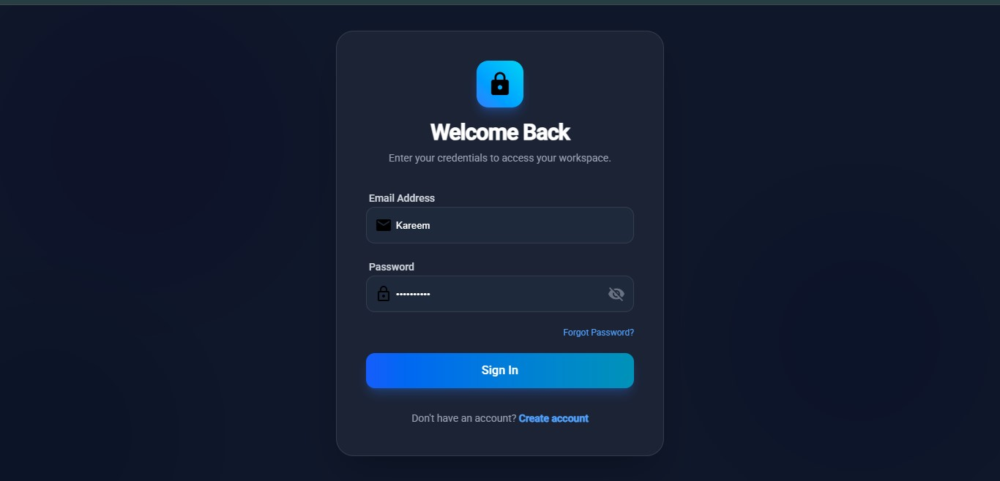
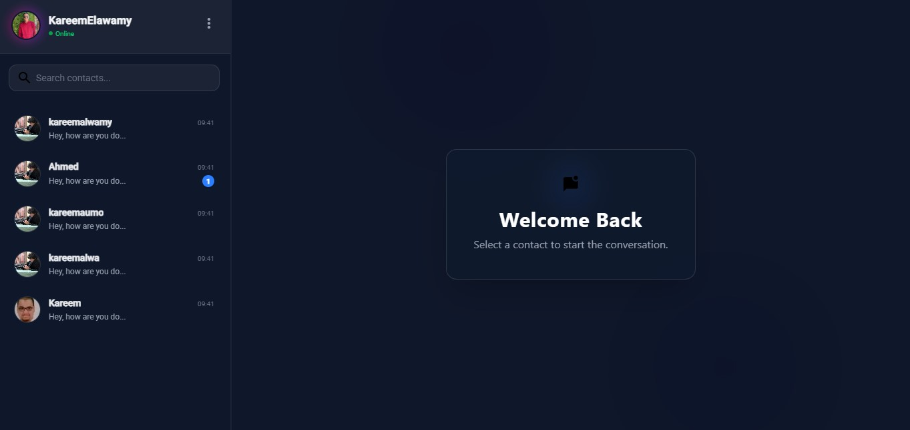
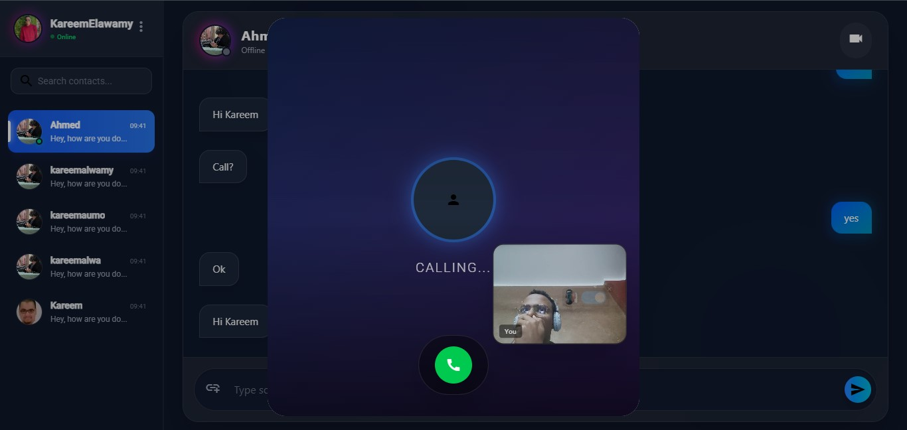
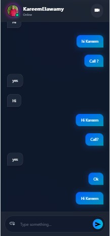

# 🚀 Nexus Chat | Next-Gen Communication Platform


> **A futuristic, real-time chat and video conferencing application built with a "Cyber-Glass" aesthetic.** > Combining the power of **SignalR** for instant messaging and **WebRTC** for peer-to-peer video calls, wrapped in a high-performance **Angular 17** frontend powered by **GSAP** animations.

---

## 📸 Screenshots & UI Showcase

| **Futuristic Login Portal** | **Glassmorphism Chat Interface** |
|:---:|:---:|
|  |  |

| **P2P Video Calling** | **Interactive User Chat Phone** |
|:---:|:---:|
|  |  |

---

## ✨ Key Features

### 🎨 User Experience (UI/UX)
* **Cyber/Glass Theme:** A fully custom dark mode design using backdrop-filters, gradients, and neon glows.
* **GSAP Animations:** Staggered list entrances, bouncing buttons, and smooth page transitions.
* **Responsive Design:** Optimized layout that adapts seamlessly from Desktop to Mobile (Stories-like bar on mobile).

### 💬 Communication
* **Real-time Messaging:** Instant delivery using **SignalR** WebSockets.
* **Typing Indicators:** Real-time "User is typing..." animations.
* **Online Status:** Live tracking of online/offline users.

### 📹 Video & Media
* **WebRTC Video Calls:** High-quality, low-latency peer-to-peer video and audio calls.
* **Call Controls:** Mute audio, toggle camera, and end call with floating glass controls.
* **Media Gallery:** (UI) Organized view of shared photos and documents.

### 🔐 Security & Core
* **JWT Authentication:** Secure login and registration with token management.
* **Validation:** Robust frontend form validation with visual feedback.

---

## 🛠️ Technology Stack

### **Frontend (The Client)**
* **Framework:** Angular 17 (Standalone Components).
* **Styling:** Tailwind CSS (Utility-first), Custom CSS Variables.
* **Animations:** GSAP (GreenSock), Anime.js.
* **Components:** Angular Material (Icons, Dialogs, Snackbars).
* **Protocols:** WebRTC (PeerJS/Native), WebSocket.

### **Backend (The Server)**
* **Framework:** ASP.NET Core 8 Web API.
* **Real-time:** Azure SignalR Service / Native SignalR.
* **Database:** SQL Server / Entity Framework Core.
* **Auth:** ASP.NET Core Identity (JWT Bearer Tokens).

---

## 🚀 Getting Started

Follow these steps to set up the project locally.

### Prerequisites
* Node.js (v18+)
* .NET 8 SDK
* SQL Server (LocalDB or Express)

### Installation
1. **Backend Setup**
   ```bash
   cd API  
   dotnet restore
   dotnet run

2. **Frontend Setup**
   ```bash
   cd client
   npm install
   ng serve --o
1. **Clone the repository**
   ```bash
   git clone [https://github.com/kareem-elawamy/Chat.git](https://github.com/kareem-elawamy/Chat.git)

   
